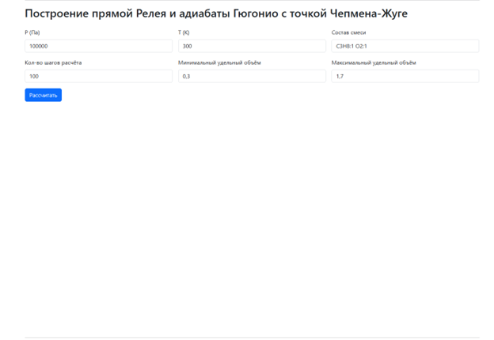
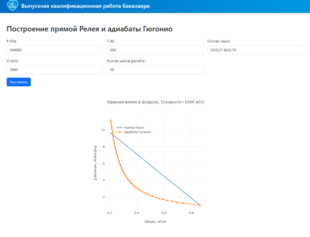

# Выпускная квалификационная работа

**Тема:** Численное построение детонационной адиабаты газообразных горючих смесей  
**Автор:** Карнаков Никита Дмитриевич                                           
 **Группа:** М8О-406Б-21


## Описание проекта  

Актуальность работы - Работа актуальна тем, что в ней реализован Python алгоритм численного построения детонационной адиабаты газообразных горючих смесей, который можно внедрять в любые расчетные системы (например, добавить в качестве модуля в коллекцию библиотек Python). Практическая значимость обеспечивается тем, что решение данной задачи реализовано в виде веб-сервиса, в котором достаточно ввести состав газа в браузере, чтобы за секунды получить интерактивные графики P–V и T–V, скачать полученные результаты в виде отчета в формате PDF. Серверная архитектура позволяет масштабировать вычисления и обновлять расчетные схемы без изменений на клиенте. Поскольку на 2025 год отсутствуют аналоги для онлайн-расчёта детонационной адиабаты произвольного состава с визуализацией и экспортом отчётов, разработанный сервис заполняет значимый технологический пробел. 

Цель работы — Разработка, программная реализация веб-сервиса, обеспечивающего численное построение детонационной адиабаты газообразных горючих смесей с автоматической визуализацией результатов и формированием отчётной документации. 

## Файлы проекта  
| Файл                  | Назначение                                                                 |
|-----------------------|---------------------------------------------------------------------------|
| `/backend/main`          | Модуль main.py         |
| `/backend/ThermoBaseR.sqlite`        | База данных термодинамических свойств веществ                              |
| `/backend/test`    | Смесь для теста  |
| `/backend/services/adiabat.py`         | Модуль построения детонационной адиабаты                         |
| `/backend/services/cj_calc.py`         | Модуль решения задачи определения параметров детонационной волны                         |
| `/backend/services/equilibrium.py`         | Модуль численного решения задач химического равновесия                         |
| `/backend/services/thermo_db.py`         | Модуль интерфейса хранилища термоданных                         |
| `/backend/services/thermo_parser.py`         | Модуль конструирования объектов термоданных                         |
| `/backend/services/trm_to_txt.py`         | Модуль преобразования файлов формата .trm                         |
| `/frontend/index.html`         | Модуль пользовательского интерфейса HTML|

## Запуск

```python -m uvicorn backend.main:app --reload --port 8000```

## Результаты

|  |
|:-----------------------------------:|
| *Рис. 1. Пример работы локального сервера с логами* |

|  |
|:-----------------------------------:|
| *Рис. 2. Общий вид web-интерфейса.* |

|  |
|:-----------------------------------:|
| *Рис. 3. Тест смеси.* |

|  |
|:-----------------------------------:|
| *Рис. 4. Ввод данных.* |

|  |
|:-----------------------------------:|
| *Рис. 5. P-V и T-V Диаграммы.* |

|  |
|:-----------------------------------:|
| *Рис. 6. Пример отчета.* |


