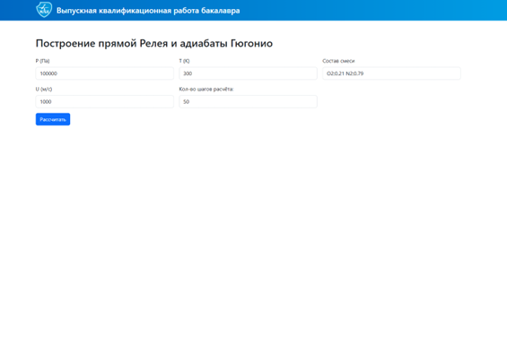
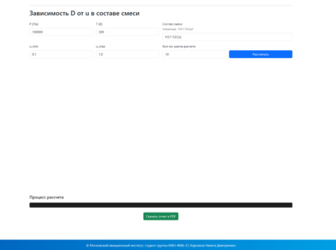

# Выпускная квалификационная работа бакалавра

**Тема:** Численное построение детонационной адиабаты газообразных горючих смесей  
**Автор:** Карнаков Никита Дмитриевич                                           
 **Группа:** М8О-406Б-21


## Описание проекта  

Актуальность работы - Отсутствие аналогов web-интерфейсов, решающих данные типы задач в в открытом доступе с автоматическим формированием PDF-отчета и сложность установки открытых библиотек для решения данного типа задач.

Цель работы — Создание веб-сервиса, обеспечивающего численное построение детонационной адиабаты газообразных горючих смесей с визуализацией результатов и формированием отчётной документации. 

## Файлы проекта  
| Файл                  | Назначение                                                                 |
|-----------------------|---------------------------------------------------------------------------|
| `/backend/main`          | Модуль main.py         |
| `/backend/airNASA9ions.yaml, mevel2017.yaml, mevel2018.yaml`        | База данных термодинамических свойств веществ                              |
| `/backend/config.py`    | Модуль с константными величинами  |
| `/backend/postshock.py`         | Модуль с основными функциями для численного расчета                         |
| `/backend/thermo.py`         | Модуль для вычисления термодинамических величин                        |
| `/backend/reley_hugoniot.py`         | Модуль для построения прямой Релея и адиабаты Гюгонио                         |
| `/backend/CJ_reley_hugoniot.py`         | Модуль для построения прямой Релея и адиабаты Гюгонио с точкой Чепмена-Жуге                        |
| `/backend/CJ_Speed_Preassure_Tempareture.py`         | Модуль для построения зависимости скорости детонации, давления и температуры от дольного состава одного из компонентов смес                        |
| `/report_example.pdf`         | Пример сгенерированного PDF-отчета                         |

## Запуск

```python -m uvicorn backend.main:app --reload --port 8000```

## Результаты

|  |
|:-----------------------------------:|
| *Рис. 1. Общий вид web-интерфейса, первая задача* |

|  |
|:-----------------------------------:|
| *Рис. 2. Общий вид web-интерфейса.* |

|  |
|:-----------------------------------:|
| *Рис. 3. Тест смеси.* |

|  |
|:-----------------------------------:|
| *Рис. 4. Ввод данных.* |

|  |
|:-----------------------------------:|
| *Рис. 5. P-V и T-V Диаграммы.* |

|  |
|:-----------------------------------:|
| *Рис. 6. Пример отчета.* |


